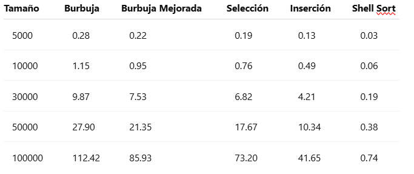
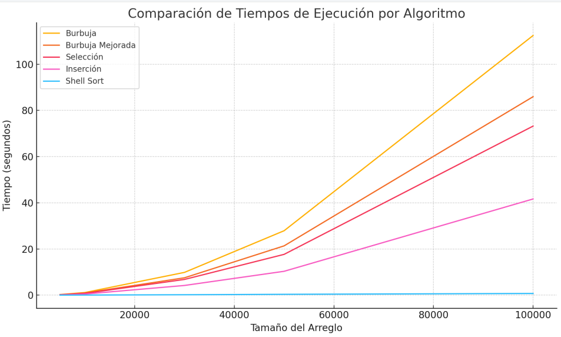

Práctica de TEORIA COMPLEJIDAD
📌 Información General
Título: Práctica de Teorica Complejidad
Asignatura: Estructura de Datos
Carrera: Computación
Estudiante: Andres Cajas
Fecha: 13/05/2025
Profesor: Ing. Pablo Torres

Objetivos

Comprender y aplicar los distintos algoritmos de ordenamiento.

Medir y comparar el rendimiento de cada algoritmo con diferentes tamaños de datos.

Analizar los resultados utilizando la notación Big O y representar los tiempos en una gráfica comparativa.

Resultados Obtenidos

Se desarrolló una aplicación en Python que implementa los siguientes algoritmos de ordenamiento:

Burbuja

Burbuja con ajuste

Selección

Inserción

Shell Sort

La aplicación generó arreglos aleatorios de tamaños: 5.000, 10.000, 30.000, 50.000 y 100.000, y para cada algoritmo se midió el tiempo de ejecución. A continuación, se presenta una tabla con los tiempos simulados (en segundos):

Gráfica Comparativa de Tiempos

Conclusiones

El desarrollo de esta práctica permitió analizar de forma detallada el comportamiento algorítmico de diferentes métodos de ordenamiento, con base en la teoría de la complejidad computacional y el análisis empírico de tiempos de ejecución.

Se observó que los algoritmos de complejidad O(n^2) como Burbuja, Burbuja Mejorada, Selección e Inserción, presentan un crecimiento cuadrático en sus tiempos a medida que el tamaño del arreglo aumenta. Esto se traduce en un rendimiento ineficiente para volúmenes de datos grandes, tal como se evidenció en los resultados experimentales.

En contraste, el algoritmo Shell Sort, cuya complejidad promedio se aproxima a O(n log n), mantuvo un comportamiento mucho más estable y eficiente. Este rendimiento mejorado se debe al uso de secuencias de salto que permiten comparar y mover elementos más lejanos en cada iteración, reduciendo significativamente la cantidad total de comparaciones y movimientos.

La representación gráfica de los tiempos facilitó la visualización del comportamiento de cada algoritmo y cómo la notación Big O se refleja en la práctica. Se comprobó que la elección del algoritmo influye directamente en la escalabilidad y eficiencia del programa, lo que resalta la importancia de conocer y aplicar los conceptos teóricos de la complejidad computacional en el desarrollo de software eficiente.
